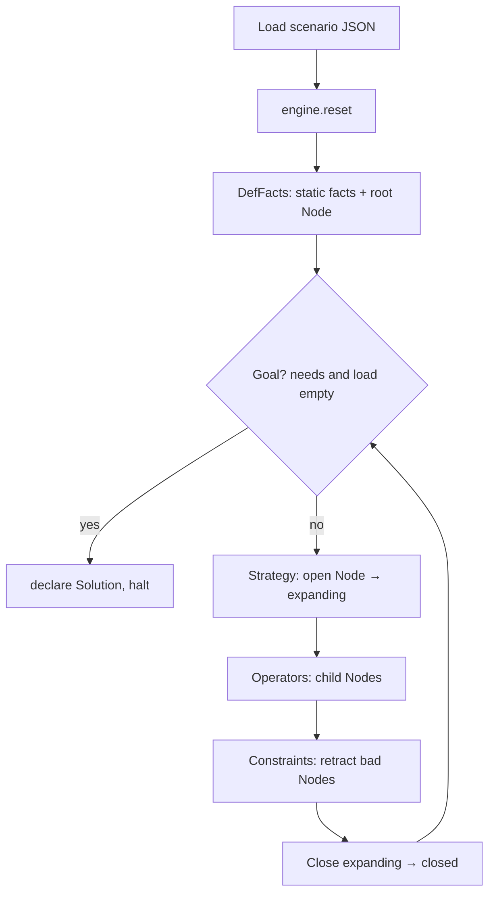

# Flower Robot

A rule-based expert system built with [experta](https://github.com/nilp0inter/experta) that models a **grid-world bouquet-delivery robot** as **state-space search**. The robot moves on a grid, loads bouquets at a warehouse, unloads them at pavilions, and the engine finds a plan that satisfies all delivery needs—using **A\*** for minimum cost or **DFS** for exploration.

This document explains the project layout and how a run works end to end, including for readers who are new to experta.

---

## Quick start

**Requirements:** Python 3.14+, [uv](https://docs.astral.sh/uv/)

```bash
git clone https://github.com/C0ncatS/flower-exhibition-robot-kbs
cd flower-robot   # or your clone directory name
uv sync
uv run flower-robot --strategy astar
```

Equivalent entry point:

```bash
uv run python main.py --strategy astar
```

### CLI examples

```bash
# Depth-first search and print the generated search tree
uv run flower-robot --strategy dfs --show-tree

# Compare DFS and A* on the default scenario
uv run flower-robot --strategy both

# Uniform-cost style search (h = 0)
uv run flower-robot --strategy astar --heuristic zero

# Custom scenario file
uv run flower-robot --scenario scenarios/example.json --strategy astar

# Cap experta rule activations (useful while debugging)
uv run flower-robot --strategy astar --max-steps 50000
```

On the bundled **5×5** scenario (`scenarios/example.json`), A* typically finds a solution with **total cost 29** (moves + loads + unloads).

| Flag | Description |
|------|-------------|
| `--scenario PATH` | JSON scenario (default: bundled example) |
| `--strategy dfs \| astar \| both` | Search strategy (default: `astar`) |
| `--heuristic default \| zero` | A* heuristic (default: `default`) |
| `--show-tree` | Print search tree after the run |
| `--max-steps N` | Stop after N experta activations |

---

## Problem

- A **grid** contains a **warehouse**, a **robot start** position, and several **pavilions** (each needs bouquets by flower type and color).
- **Move** one step (cost 1), **load** at the warehouse (cost 1), **unload** at a pavilion (cost 1).
- **Loading rules:** each load is either bouquets of the **same color across types** or the **same type across colors**; capacity is the largest total need at any single pavilion.
- **Goal:** every pavilion need is satisfied and the robot carries nothing.

The implementation encodes that as forward-chaining search: each search state is a **`Node` fact** in working memory.

---

## Experta in brief

Experta is a Python forward-chaining engine (similar in spirit to CLIPS):

| Concept | Role here |
|--------|-----------|
| **Fact** | Knowledge in working memory (position, legal move, search node, …). |
| **Rule** | `IF` patterns match facts `THEN` run an action (declare / modify / retract, halt). |
| **Agenda** | Ready rules; **salience** sets priority (higher first). |
| **DefFacts** | Facts inserted on `engine.reset()`. |
| **KnowledgeEngine** | Subclassed and driven with `reset()` then `run()`. |

```
reset()  →  static facts + root Node
run()    →  pick rule → fire → update facts → repeat until halt or idle
```

Search states live in **`Node` facts**, not hidden globals. Rules match `open` or `expanding` nodes, generate children, prune invalid states, and stop when a goal node appears.

---

## Repository layout

```
.
├── main.py                      # Entry: flower_robot.cli.main
├── scenarios/
│   └── example.json             # Default 5×5 instance
├── knowledge_base_assignment.md # Original problem statement (Arabic)
└── src/flower_robot/
    ├── compat.py                # Python 3.14 shim for experta / frozendict
    ├── cli.py                   # Arguments and run loop
    ├── domain/                  # Pure Python (no experta)
    │   ├── models.py            # Scenario, Pavilion
    │   ├── state.py             # Load / needs tuples, validity
    │   ├── choices.py           # Adjacency, load, unload options
    │   ├── position.py          # Grid positions, Manhattan distance
    │   └── flowers.py           # Flower types and colors
    ├── facts/
    │   └── schema.py            # Fact subclasses (Node, AdjacencyFact, …)
    ├── search/
    │   ├── node_factory.py      # Child Node facts (g, h, f)
    │   └── heuristics.py        # Admissible h(n) for A*
    ├── engine/                  # experta rules and engine
    │   ├── search_engine.py     # FlowerRobotEngine, DefFacts, deduplication
    │   ├── operators.py         # move / load / unload rules
    │   ├── constraints.py       # Retract invalid nodes
    │   ├── strategy.py          # DFS vs A* selection
    │   ├── goal.py              # Goal → Solution + halt
    │   └── tree.py              # Tree recording for printing
    └── io/
        ├── scenario_loader.py
        └── reporting.py
```

**Layers:**

- **`domain/`** — problem logic and precomputation (loops and conditionals are fine).
- **`facts/`** — shapes stored in working memory.
- **`engine/`** — when rules fire and what they change.
- **`search/`** — child states and scoring.

---

## How a run works



1. **`load_scenario()`** builds a `Scenario`.
2. **`FlowerRobotEngine.reset()`** via `@DefFacts` declares grid, warehouse, pavilions, max load, choice-point facts (`LoadOptionFact`, `UnloadOptionFact`, …), A* helper (`LowestOpenNodeFact`), and the root **`Node`** (open, g=0).
3. **`engine.run()`** runs until the agenda is empty or **`halt()`** after a goal.

**Salience (priority) overview:**

| Salience | Rules |
|---------|--------|
| 200 | Record node in search tree |
| 350 | A*: update lowest open f |
| 340 | A*: clear stale lowest-open tracker |
| 330 | A*: seed lowest-open tracker |
| 100 | Pick next node (DFS or A*) |
| 90 | Goal found |
| 85 | Constraint violations → retract |
| 50 | Operators (move / load / unload) |
| -100 | Mark expanded node closed |

---

## Facts

### Static (scenario + choice points)

Declared once at reset; unchanged during search.

| Fact | Purpose |
|------|---------|
| `GridFact`, `WarehouseFact`, `PavilionFact`, `MaxLoadFact` | Problem definition |
| `GridFact` + move rules | One-step moves; bounds via `TEST` on the LHS |
| `LoadOptionFact` | One legal warehouse load bundle |
| `UnloadOptionFact` | One legal unload at a pavilion |
| `StrategyFact` | `dfs` or `astar` |
| `LowestOpenNodeFact` | A*: tracks the open node with minimum f without Python `min()` in rules |

Choice enumeration is pushed into facts so operator rules stay thin: each legal load/unload is its own fact, and experta’s matcher fires the same rule once per match.

### `Node` (search tree)

| Field | Meaning |
|-------|---------|
| `pos` | Robot position |
| `load` / `needs` | Carried bouquets / remaining pavilion needs |
| `g`, `h`, `f` | Path cost, heuristic, f = g + h |
| `status` | `open` \| `expanding` \| `closed` |
| `parent`, `action` | Solution path reconstruction |

Children are built in **`search/node_factory.py`** and declared through **`engine.declare()`**, with duplicate pruning in `_declare_node`.

---

## Rules (reading order)

1. **`engine/operators.py`** — Expansion on `Node(status="expanding")`: move, load, unload.
2. **`engine/constraints.py`** — Retract overloads, illegal mixes, out-of-bounds states, etc.
3. **`engine/strategy.py`** — DFS: any open node; A*: expand the tracked lowest-f open node.
4. **`engine/goal.py`** — Empty load and needs → solution + halt.
5. **`engine/tree.py`** — Optional tree output.
6. **`engine/search_engine.py`** — Engine mixin, `@DefFacts`, deduplication, solution path.

### Where loops belong

| Location | Loops in rule bodies? |
|----------|------------------------|
| `engine/` `@Rule` bodies | Avoid for search logic; use patterns and facts |
| `@DefFacts scenario_facts` | Yes — bootstrap static facts |
| `domain/choices.py` | Yes — precompute options before `run()` |
| `search/node_factory.py` | Yes — g, h, transition checks |
| `_declare_node` | Yes — closed-set deduplication |

---

## DFS vs A*

| | **DFS** | **A\*** |
|--|---------|---------|
| Order | Recency + first `open` → `expanding` | Lowest **f** via `LowestOpenNodeFact` |
| Optimality | Not guaranteed | Yes with admissible **h** (`default_heuristic`) |
| Tree | `--show-tree` or default when strategy is `dfs` | Solution path; use `--show-tree` to force tree |

Heuristics (`search/heuristics.py`):

- **`default`** — Underestimates remaining load/unload work and travel.
- **`zero`** — h = 0 (uniform-cost behavior).

---

## Custom scenarios

Add JSON under `scenarios/` (see `scenarios/example.json`):

```json
{
  "grid": { "width": 5, "height": 5 },
  "warehouse": [2, 3],
  "robot_start": [3, 1],
  "pavilions": [
    {
      "id": "pavilion_1",
      "flower_type": "rose",
      "position": [4, 2],
      "needs": { "red": 2, "pink": 1 }
    }
  ]
}
```

- Positions are **1-based** `(x, y)`.
- `flower_type` values: `rose`, `tulip`, `orchid`, `juliet_rose` (see `domain/flowers.py`).

```bash
uv run flower-robot --scenario path/to/your.json --strategy astar
```

---

## Python 3.14 and experta

experta relies on deprecated APIs (`collections.Mapping`). Import **`flower_robot.compat`** before experta (already done in `cli.py`, `facts/schema.py`, and engine modules). New modules that import experta should import compat first.

---

## Learning path

| Topic | Where to look |
|-------|----------------|
| Initial state as facts | `engine/search_engine.py` → `scenario_facts`, root `Node` |
| Move / load / unload | `engine/operators.py` |
| Constraints | `engine/constraints.py` |
| Goal and solution path | `engine/goal.py`, `record_solution` in `search_engine.py` |
| Search tree output | `engine/tree.py`, `io/reporting.py` |
| A* (f = g + h) | `search/node_factory.py`, `search/heuristics.py`, `engine/strategy.py` |
| Full problem narrative | `knowledge_base_assignment.md` |

---

## Further reading

- [experta on GitHub](https://github.com/nilp0inter/experta)
